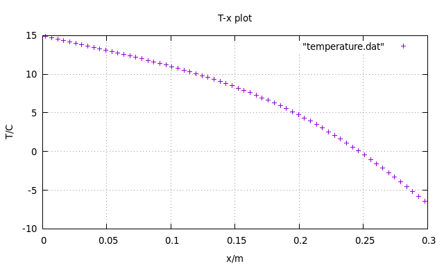
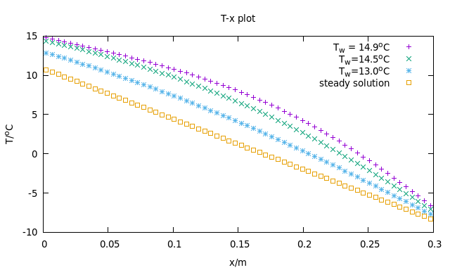

# NHT
数值传热学大作业-通用一维导热计算
- 一维稳态/非稳态无内热源导热问题
- 三种边界条件可指定
- 全隐格式，附加源项法
- 提供TDMA,jacobi迭代,Guass-Seidel迭代求解器
- 通过控制文件指定参数，不需重复编译

## HOW TO RUN
Linux 环境下

```bash
sdp@ENIAC:~$ cd NHT/
sdp@ENIAC:~/NHT$ make
sdp@ENIAC:~/NHT$ ./calc
```
清理编译输出

```bash
sdp@ENIAC:~$ make clean
```
## controlDict参数解释

```markdown
# ------------ Geometry properties ---------------
# Geometry Length
L 0.3 
# Number of nodes
N 64 
# Spatial (s)
dt 60 
# ------------ Physical properties ---------------
# rho*c
RHOC 1.05e6 
# conductivity
K 0.85 
# ------------ Initial condition -----------------
# left temperature
TA 20 
# right temperature
TB -10 
# ----------- Boundary condition -----------------
# decide if it's steady or unsteady
unSteady 1  
# boudary condition 
Boundary_L 3 
Boundary_R 3 
# heat flux if B.C 2 if choosen
Q_L 0 
Q_R 0 
# wall h if B.C 3 is choosen
A1 6 
A2 35 
# ----------- Linear solver ----------------------
# solver used: TDMA, jacobi or guassSeidel
solver TDMA 
# precsion of iterative solver 
P 1e-8 
```
以上为默认参数，在`Parameters`类的构造函数中已经包含。

## RESULT




